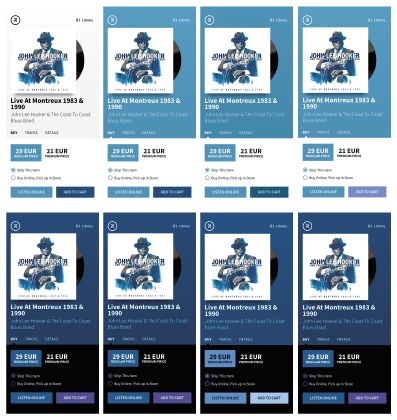

# Automatic Color Theme Generation for User Interfaces Based on Featured Image

A web application called "Records" is used for browsing and purchasing music
albums. It is intended for demonstrating and testing the model for automatic
color theme generation. Therefore, it contains limited data, and certain
functionalities still need to be implemented (e.g., listening to audio tracks
and making purchases).

The application is built using the React JavaScript library. The Reach Router
library is used for routing between pages, and the Service Worker API is
employed to enable offline functionality. User settings are stored in the
browser's local storage. For rapid development, we used Material UI design
system.

This project was bootstrapped with
[Create React App](https://github.com/facebook/create-react-app).

## Available Scripts

In the project directory, you can run:

### `yarn start`

Runs the app in the development mode.  Open
[http://localhost:3000](http://localhost:3000) to view it in the browser.

The page will reload if you make edits.  You will also see any lint errors
in the console.

### `yarn test`

Launches the test runner in the interactive watch mode.  See the section
about
[running tests](https://facebook.github.io/create-react-app/docs/running-tests)
for more information.

### `yarn build`

Builds the app for production to the `build` folder.  It correctly bundles
React in production mode and optimizes the build for the best performance.

The build is minified and the filenames include the hashes.  Your app is
ready to be deployed!

See the section about
[deployment](https://facebook.github.io/create-react-app/docs/deployment) for
more information.

### `yarn eject`

**Note: this is a one-way operation. Once you `eject`, you can’t go back!**

If you aren’t satisfied with the build tool and configuration choices, you can
`eject` at any time. This command will remove the single build dependency from
your project.

Instead, it will copy all the configuration files and the transitive
dependencies (webpack, Babel, ESLint, etc) right into your project so you have
full control over them. All of the commands except `eject` will still work, but
they will point to the copied scripts so you can tweak them. At this point
you’re on your own.

You don’t have to ever use `eject`. The curated feature set is suitable for
small and middle deployments, and you shouldn’t feel obligated to use this
feature. However we understand that this tool wouldn’t be useful if you couldn’t
customize it when you are ready for it.
